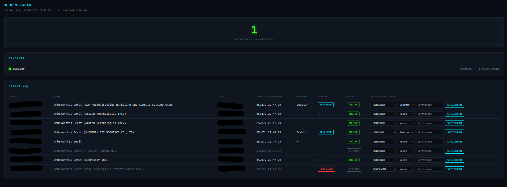

# HomeRadar

Ein self-hosted Spring-Boot-Tool zur Überwachung des eigenen Heimnetzes.
HomeRadar scannt das lokale Netz, erkennt anwesende Geräte und – über deren
Zuordnung zu Personen – wer zu Hause ist. Taucht ein unbekanntes Gerät auf,
während niemand anwesend ist, wird ein Alarm ausgelöst.

## Leitprinzip: powerful through architecture, not overreach

HomeRadar ist bewusst so entworfen, dass es nur mit Daten arbeitet, die im
eigenen Netz ohnehin sichtbar sind, und diese nirgendwohin abfließen:

- **Consent-basiert:** Personen und ihre Geräte werden manuell zugeordnet.
  Es gibt kein heimliches Tracking – nur explizit gepflegte Zuordnungen fließen
  in die Anwesenheitslogik ein.
- **Privacy by Design:** Die Herstellererkennung läuft vollständig offline über
  eine lokal abgelegte IEEE-OUI-Liste. Es werden keine MAC-Adressen oder
  Gerätedaten an externe Dienste geschickt.
- **Komplett self-hosted, keine Cloud:** Alles läuft auf der eigenen Maschine,
  die Daten liegen in einer lokalen H2-Datei-Datenbank.

Ein konkretes Beispiel für dieses Prinzip: Eine **Presence-Baseline** – also das
Lernen typischer Anwesenheitsmuster über die Zeit – wurde bewusst **verworfen**.
Sie hätte die Erkennung verbessern können, aber um den Preis eines dauerhaften
Verhaltensprofils der Bewohner. Das widerspricht dem Anspruch, nur das
Nötigste zu erfassen. Fähigkeit entsteht hier aus der Architektur, nicht aus dem
Sammeln von mehr Daten.

## Features

- **Ping-Sweep + ARP-Scan:** Aktualisiert die ARP-Tabelle per Ping-Sweep und
  liest sie anschließend aus, um aktive Geräte zu finden.
- **Anwesenheitserkennung:** Ein Gerät gilt innerhalb einer konfigurierbaren
  Toleranz als online; eine Person ist anwesend, wenn mindestens eines ihrer
  Geräte online ist.
- **Intrusion-Alarm mit Quittierung:** Unbekannte Geräte bei abwesenden
  Bewohnern lösen einen Alarm aus. Pro Gerät entsteht nur ein offener Alarm
  (kein Spam bei jedem Scan); Alarme lassen sich im Dashboard quittieren.
- **Hersteller-Anzeige per IEEE-OUI-Lookup (offline):** Geräte ohne gepflegten
  Namen werden als „Unbekanntes Gerät (&lt;Hersteller&gt;)" angezeigt.
  Randomisierte (lokal verwaltete) MAC-Adressen werden dabei übersprungen.
- **Klassifizier-UI im Dashboard:** Geräte lassen sich direkt in der Oberfläche
  klassifizieren (Klasse, Personenzuordnung, Name) – ohne SQL.
- **REST-API:** JSON-Endpunkte für Anwesenheit, Geräte und Alarme.

## Screenshot

<!-- TODO: Screenshot des Dashboards einfügen -->



## Stack

- Java 21 (Build mit JDK 21 oder neuer)
- Spring Boot
- Maven (inkl. Wrapper)
- H2 (file-based)
- Thymeleaf

## Getting Started

```bash
git clone <repo-url>
cd homeradar
./mvnw spring-boot:run
```

Das Dashboard ist anschließend unter <http://localhost:8080> erreichbar.

Das zu scannende Subnetz lässt sich in `src/main/resources/application.properties`
anpassen:

```properties
homeradar.subnetz=192.168.178
homeradar.toleranz-minuten=5
```

**Hinweis (Windows):** Das ARP-Parsing ruft `arp -a` auf und liest die Ausgabe
mit `Cp850`-Encoding. HomeRadar ist derzeit auf Windows-Umgebungen ausgelegt.

### REST-API

| Methode | Pfad | Zweck |
| --- | --- | --- |
| GET | `/api/anwesend` | Aktuell anwesende Personen |
| GET | `/api/person/{name}/anwesend` | Anwesenheit einer bestimmten Person |
| GET | `/api/geraete` | Alle Geräte mit Online-Status |
| GET | `/api/alarme` | Offene (nicht quittierte) Alarme |
| POST | `/api/alarme/{id}/quittieren` | Alarm quittieren |

## Ausblick

Geplant ist ein `/api/radar/status`-Endpoint, der einen kompakten
Anwesenheits- und Alarmstatus liefert – gedacht als Anbindung für einen
lokalen Sprachassistenten.
